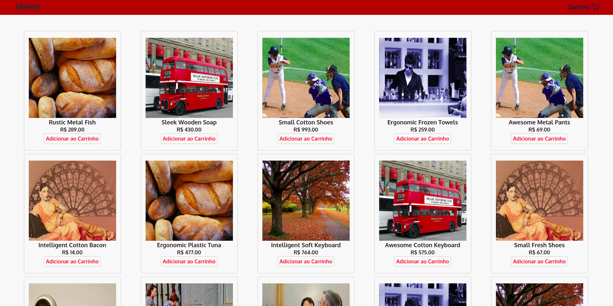
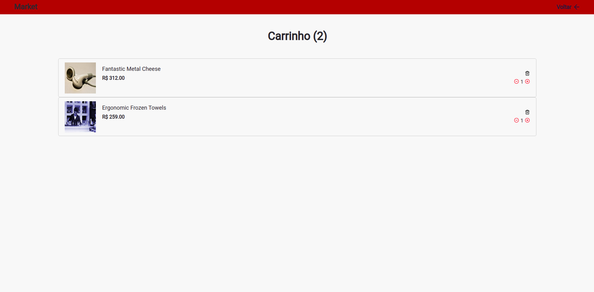
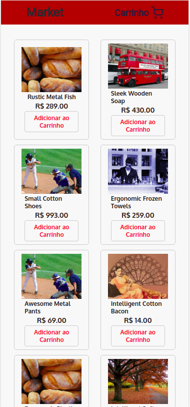
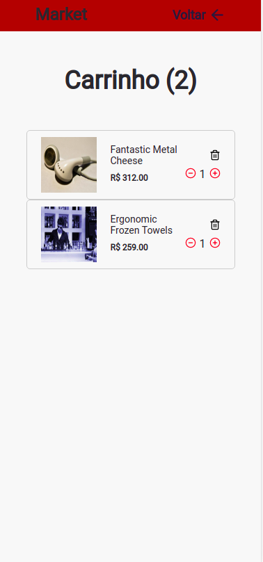

# Market

## Descrição do Projeto

O projeto utiliza uma api, que trás produtos e esses produtos são exibidos na tela, com possibilidade de adicioná-los ao carrinho de compras.

o projeto tem o foco de desenvolvimento no processo seletivo da empresa Liven

🚀 Aplicação web responsiva

<strong>Página inicial</strong>

<strong>Carrinho de compras</strong>

<strong>Página inicial responsiva</strong>

<strong>Carrinho de compras responsiva</strong>
 

### 🛠 Utilizar

Para utilizar localmente:

<ul>
	<li>clonar o repositório do github</li>
	<li>rodar o comando > git clone link-copiado</li>
	<li>rodar o comando > yarn add</li>
	

### 🛠 Tecnologias

As seguintes ferramentas foram usadas na construção do projeto:

- [React](https://pt-br.reactjs.org/)
- [TypeScript](https://www.typescriptlang.org/)

<h4 align="center"> 
	🚧  Moveitnow 🚀 Em construção...  🚧
</h4>

 
  
 <b>Rafael</b></a>

Feito por Rafael Borges.
